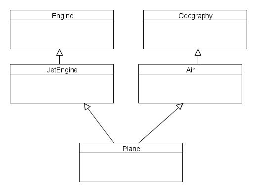

layout: true
class: middle

---

background-image: url()
# Abstract base classes,
# Pure virtual functions &
# Multiple inheritance

---


Announcements:
- C++11 in FF
- Eng Week

---

background-image: url(./res/blankcard1.jpg)
# 1. Abstract
# base classes

---

Suppose a coffee shop uses a different class to represent each of its hot beverages:

```c++
class Ristretto {
  double espresso;
};

class Breve {
  double espresso;
  double milk;
  double cream;
};

class Mochaccino {
  double espresso;
  double chocolate;
};

```

---

These are all espresso-based drinks. But if you ask the barista for an espresso-based drink, he'll ask which one.

If we made an `EspressoDrink` class, it wouldn't make sense to instantiate it. It's just a description (or outline or blueprint or category) of other concrete classes.

---

New concept:

*Abstract base class*

An abstract base class represents the generic, abstract form of all the classes that derive from it, but is never instantiated.

---

A class is made abstract by making (at least) one of its functions *pure virtual*

---

background-image: url(./res/emptycase1.jpg)
# 2. Pure virtual
#    functions

---

So far, *virtual* meant that a class function could be *overridden* by a derived class.

If a base class is abstract, a virtual function that **will** be overridden will never be called:
- The base class won't be instantiated, so the function cannot be called on base class objects
- Derived classes will override the function, so the original version will disappear from the hierarchy

---

New concept:

*Pure virtual function*

A pure virtual function is a virtual function with no implementation that must be overridden* in derived classes.

*sort of; actually implemented

---

A virtual function is made *pure* by adding =0 to it:

```c++
class AbstractBase {
  virtual void foo() = 0;
};
```

---

.strike[You do not create a {body} for a pure virtual function.]

---

You cannot instantiate an object of a class that has a pure virtual function. Such a class is *abstract*.

---

If a derived class doesn't override a pure virtual function, that class is also abstract.

---


**Q**: What if you don't want to create a pure virtual function?

E.g. your base class doesn't have any functions, or has several functions, but you don't want to force any specific one to be overridden?

---


**A**: You can:
- Make the constructor protected (not technically abstract)
- Make the destructor pure virtual (but still implement it!)

---

```c++
class AbstractBase {
protected:
  AbstractBase() {}
  virtual ~AbstractBase() =0;
};

AbstractBase::~AbstractBase() {}
```

---

background-image: url(./res/powerrangers1.jpg)
# 3. Multiple
# inheritance

---

If *Base class* only refers to a derived class's **direct** parent,

then even in an inheritance chain like this:
```c++
class A {};
class B: public A {};
class C: public B {};
class D: public C {};
```
each class has only one base class (except A)

---

Side note on member visibility:

```c++
class A {
public: void foo();
protected: void bar();
private: void baz();
};
class B: public A {};
class C: protected B {};
class D: private C {};
```

---

You've seen multiple classes derive from a single base class, but so far, each class had just one base.

*Multiple inheritance* means that a derived class has two or more base classes.

All the members from all the base classes are inherited.
---

.center[.middle[]]

---

```c++
class Derived: public Base1, public Base2 {
  // ...
};
```
Base classes are listed, separated by commas. Each base class has an access specification.

---

Invoking base class constructors:

```c++
class Derived: public Base1, public Base2 {
  Derived(): Base2(), Base1() {}
  Derived(int i, int j): Base2(i), Base1(j) {}
  // ...
};
```

---

**Q:** In what order are the base class constructors invoked?

**A:** In the order of inheritance

---

As with singly-inherited base classes, you don't need to explicitly invoke destructors.

```c++
class Derived: public Base1, public Base2 {
  // ...
  ~Derived() {...}
  // ...
};
```

---

**Q:** In what order are the base class destructors invoked?

**A:** In the reverse order of inheritance

---

*Ambiguous members:*

If two base classes have members with the same name, they become ambiguous members of a derived class.

---

```c++
class Base1 {
public:
  int x;
  void foo() {
    cout << "1" << endl;
  }
};

class Base2 {
public:
  int x;
  void foo() {
    cout << "2" << endl;
  }
};

class Derived: public Base1, public Base2 {
  // ...
};

Derived o;
o.x = 1; // ?
o.foo(); // ?
```

---

Then you should redefine or override the members.

```c++
class Derived: public Base1, public Base2 {
public:
  // ...
  int x;
  void foo();
};
```
Now this is not an ambiguous call anymore:
```c++
Derived d;
d.foo();
```

---

You can access a specific base class's members with the scope resolution operator from within the class:

```c++
class Derived: public Base1, public Base2 {
  void bar() {
    Base1::x = 0;
    Base2::foo();
  }
};
```

---

... And from objects:
```c++
Derived d;
d.Base1::foo();
d.Base2::x = 0;
```

---

A (possibly hacky) way to use a multiple-derived class's member to refer to a specific base class's member:

```c++
class Derived: public Base1, public Base2 {
public:
  int &x;
  Derived() : x(Base1::x) {}
  void foo() {Base2::foo();}
};
```

---

*The so-called diamond problem:*

When two classes share a base class, and another class inherits from both, then the base class is derived twice, and becomes an *ambiguous* base class.

---

background-image: url(./res/diamond.png)

---

background-image: url(./res/diamond2.png)

---

```c++
class Base {
public: void foo() {cout << "Yo!" << endl;}
};

class C1: public Base {};
class C2: public Base {};

class Derived: public C1, public C2 {
  void bar() {
    Base::foo(); // ambiguous!
  }
};
```

---

If any of the base classes have a version that you can use, you can invoke it specifically:

```c++
class Base {
public: void foo() {cout << "Yo!" << endl;}
};

class C1: public Base {};
class C2: public Base {
public: void foo() {cout << "Modified" << endl;}
};

class Derived: public C1, public C2 {
  void bar() {
    C1::foo(); // same as Base::foo() and not ambiguous
  }
};
```
---

If not, you can try and use *virtual inheritance*:

```c++
class Base {
public: void foo() {cout << "Yo!" << endl;}
};

class C1: virtual public Base {
public: void foo() {cout << "Modified1" << endl;}
};
class C2: virtual public Base {
public: void foo() {cout << "Modified2" << endl;}
};

class Derived: public C1, public C2 {
  void bar() {
    Base::foo();
  }
};
```
---

# End
