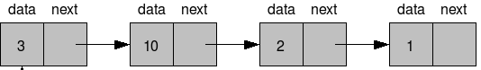
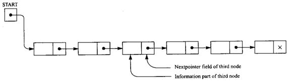

class:middle
#Linked Lists
---
class:middle
An array is a *sequential list*. Data is ordered by its position in memory.
---
class:middle
background-image:url(./i/eggs.jpg)
An array's size is fixed. Element positions are inflexible - insertion and deletion require a lot of data movement.
---
class:middle
background-image:url(./i/lights.jpg)
Linked lists encapsulate elements in *nodes* that can be placed anywhere in memory. The order of nodes in the list is determined by pointers that connect nodes.
---
class:middle
Nodes can be allocated dynamically and placed anywhere in memory (don't have to be contiguous). To reorder nodes, links are adjusted.
---
class:middle
A node contains data and a pointer to the next node in the list.



```c++
template <class T>
struct Node {
	T data;
	Node *next; // self-referential
};
```
*.nop[i]*
---
class:middle
A linked list is a data structure containing 0 or more nodes.

The list has a pointer (called `head`) that points to the first node. Each node in the list points to the next, until the last node, which points to `NULL`.



```c++
template <class T>
class LinkedList {
	Node<T> *head;
//...
};
```
If a linked list has 0 elements, the `head` member points to NULL.
*.nop[i]*
---
class:middle
You can define the `Node` struct *inside* the `LinkedList` class. This will make the struct invisible to clients.
```c++
template <class T>
class LinkedList {
	struct Node {
		T data;
		Node *next;
	} *head;
};
```
*.nop[i]*
---
class:middle
## Appending
---
class:middle
To insert the first element in an empty list:
1. Create a new node
  1. Initialize it with the element data
  2. Set its `next` pointer to `NULL`
2. Point the list's `head` pointer to the new node
---
class:middle
```c++
template <class T>
void LinkedList<T>::append(T d) {
	if (head == 0) {
		LinkedList<T>::Node *newNode = new LinkedList<T>::Node;
		newNode->data = d;
		newNode->next = 0;
		head = newNode;
	}
	// else ...
}
```
*.nop[i]*
---
class:middle
To append a new element to a non-empty list:
1. Create a new node
  1. Initialize it with the element data
  2. Set its `next` pointer to `NULL`
2. Find the last element in the list
  1. Create a node pointer
  2. Point it to the first element
  3. While its `next` pointer is not `NULL`, traverse it to its `next` pointer
3. Point the last node's `next` pointer to the new node
---
class:middle
```c++
template <class T>
void LinkedList<T>::append(T d) {
	if (head == 0) {
		// ...
	} else {
		LinkedList<T>::Node *newNode = new LinkedList<T>::Node;
		newNode->data = d;
		newNode->next = 0;

		LinkedList<T>::Node *current = head;
		while (current->next != 0)
			current = current->next;
		current->next = newNode;
	}
}
```
*.nop[i]*
---
class:middle
The code for finding the last node also demonstrates how you traverse a linked list: by repeatedly setting a `Node` pointer to its own `next` field.
---
class:middle
To print a list's contents, you can use a `Node` pointer to traverse the list and print each `Node`'s `data` field.
```c++
template <class T>
void LinkedList<T>::printContents() {
	LinkedList<T>::Node *current = head;
	while (current != 0) {
		cout << current->data << " ";
		current = current->next;
	}
}
```
*.nop[i]*

What does this code do if the list is empty?
---
class:middle
## Initializing the list
It's important to note that these functions assume that an empty list's `head` pointer is `NULL`. Initialize `head` in the constructor:
```c++
template <class T>
LinkedList<T>::LinkedList() : head(0) {
}
```
---
class:middle
## Inserting
---
class:middle
To insert a node to the middle of a list - method 1:
1. Create and initialize the new node
2. Find the position to insert the node to
  1. Traverse the list with a Node pointer called `current` until you **pass** the insert position
  2. Follow `current` with another Node pointer called `previous`
3. Insert the new node in its right position
  1. Set `previous`'s `next` link to the new node
  2. Set the new node's `next` link to `current`

Special cases:
1. If the new node is to be the last node, `current` will be `NULL`, but the algorithm will still work
2. If the new node is to be the first node, `previous` will be `NULL`. This has to be handled specifically.
3. If the list is empty, it can be treated in the same way as case 2.
---
class:middle
Assuming `insert` should maintain an ordered list:
```c++
template <class T>
void LinkedList<T>::insert(T d) {
	LinkedList<T>::Node *newNode, *current, *prev = 0;

	newNode = new LinkedList<T>::Node;
	newNode->data = d;

	current = head;
	while (current && current->data < d) {
		prev = current;
		current = current->next;
	}

	if (prev == 0)
		head = newNode;
	else
		prev->next = newNode;

	newNode->next = current;
}
```
---
class:middle
To insert a node to the middle of a list - method 2:
1. Create and initialize the new node
2. Find the position to insert the node to
  1. Traverse the list with a Node pointer called `current` until it is just **before** the insert position
3. Insert the new node after `current`
  1. Set `current`'s `next` link to the new node
  2. Set the new node's `next` link to `current`'s old `next`

Special cases:
1. If the new node is to be the last node, `current` should stop traversing if its next node is `NULL`
2. If the new node is to be the first node, `current` will be "point to" head, but the new node's data will be less than that of current
3. If the list is empty, `current` will also point to head, but it will be `NULL`.
---
class:middle
```c++
template <class T>
void LinkedList<T>::insert2(T d) {
	LinkedList<T>::Node *newNode, *current;

	newNode = new LinkedList<T>::Node;
	newNode->data = d;

	current = head;
	while (current && current->next && current->next->data < d) {
		current = current->next;
	}

   if (current == head && (!current || current->data > d)) {
         head = newNode;
         newNode->next = current;
   } else {
      newNode->next = current->next;
      current->next = newNode;
   }
}
```
---
class:middle
.nop[*]
##Notes on compiling template classes
---
class:middle
Template classes don't fit too well with the traditional compiler-linker model. Templates must be generated at compile time for each needed class, so the compiler needs to know, at compile time, which types a template will be used for. This means that generating object code for template classes without any reference to client code is not sufficient.
---
class:middle
Suppose `LinkedList` is defined as a class template, with the class' declarations in `list.h` and its implementations in `list.cpp`. Suppose a main function exists in `main.cpp`, and that this main function needs an instantiation of `LinkedList` that will store `float` values.

Normally,
- `list.cpp` would include `list.h`,
- `main.cpp` would include `list.h`,
- and we would compile and link the files like this:
```
g++ -c list.cpp -o list.o
g++ -c main.cpp -o main.o
g++ main.o list.o -o main
```
---
class:middle
But with templates, if you compile `list.cpp` without any reference to `main.cpp`, the compiler doesn't know that `main.cpp` needs a `float` version of `LinkedList`, and `list.o` won't contain one. The project will fail during linking.

There are 2 solutions.
1. Compile everything at once (by indirectly including everything from the main function file)
2. Explicitly cause the correct versions of the template to be generated by the compiler before linking (by creating unused instantiations of the templates in an instantiation file)
None of them are very sexy but that's life.
---
class:middle
.big[Method 1]

Instead of including the header from the implementation, you can include the implementation from the header:
```c++
// list.h:
template <class T>
#ifndef LIST_H
#define LIST_H
class LinkedList { ... };
#include "list.cpp"
#endif
```

```c++
// list.cpp:
template <class T>
LinkedList<T>::LinkedList() {...}
// etc...
```
---
class:middle

Now, when you include `list.h` from your client code:
```c++
#include <iostream>
#include "list.h"
using namespace std;
int main() {
	LinkedList<float> list;
	// ...
}
```
... you also include the implementation. Since the compiler sees everything as one big file now, it knows which versions of the template to generate.
---
class:middle
But, now you should take care of how you compile. Don't create object code for the template classes, and definitely don't try to link them with the main code. Remember, after all the `#include`s, `main.cpp` "contains" all the template code. You only have to compile `main.cpp` now:
```
g++ main.cpp -o main
```
But if you have other non-template classes, you should still link them the old-fashioned way:
```
g++ -c otherclass.cpp
g++ main.cpp otherclass.o -o main
```
---
class:middle
An alternative way to achieve the same effect would be to include `list.cpp` instead of `list.h`.
---
class:middle
.big[Method 2]

You can create object code for all the versions of template you are going to need by maintaining a minimal "instantiation" file with declarations of those instantiations. For example, in a file called listInst.cpp:
```c++
#include "list.cpp"
template class LinkedList<float>;
template class LinkedList<double>;
```
(`list.cpp` must include `list.h`.)

Now, you can compile listInst.cpp without linking:
```
g++ -c listInst.cpp
```
...which creates a file called `listInst.o` that contains object code for the `float` and `double` versions of the `LinkedList` template. You can link this code with `main.cpp` to make it available:
```
g++ main.cpp listInst.o -o main
```
---
class:middle
With this method, you have to make sure that the instantiation file is up to date with all the types you are going to need elsewhere.
---
