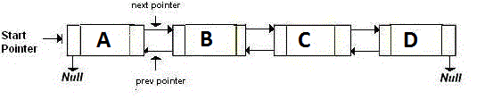

class:middle
## OTHER TYPES OF LINKED LISTS
### *doubly-linked and circularly-linked lists*
---
class:middle
In the linked lists we have created so far, each node has **one** link, which is a pointer to the next node in the list. The list maintains a pointer to the first node, and the last node's link is set to `NULL`.

What we have simply been calling "linked lists" are actually specifically *singly linked lists*, because nodes are connected by single links.

We will look at two variations of linked lists: doubly linked lists, and circularly linked lists.
---
class:middle
### Doubly linked lists
In a doubly linked list, each node has **two** links: one to the next node, as with singly linked lists, and also one to the *previous* node.
---
class:middle

---
class:middle
Doubly linked nodes have 3 fields: the element data, a link to the next node, and a link to the previous node.
```c++
template <class T>
class DoublyLinkedList {
	class Node {
		T data;
		Node *prev, *next;
		Node(T d, Node *p, Node *n):
			data(d), prev(p), next(n) {}
	} *head;
	// ....
};
```
Again, the linked list itself only needs a pointer to the first node. (What would the pros and cons of also maintaining a pointer to the last node be?)
---
class:middle
As with singly linked lists, the `next` pointer of the last node in the list should be `NULL`. In addition to that, the `prev` pointer of the first link should also be `NULL` in doubly linked lists, so that we know when we reached the first node when traversing a list backwards.
---
class:middle
Traversing a doubly linked list backwards is more efficient than doing so with a singly linked list.
---
class:middle
To print a **singly** linked list in reverse is pretty involved:
```c++
SLList<T>::Node *lastPrinted = 0, *current = head;
while (lastPrinted != head) {
	current = head;
	while (current->next != lastPrinted) {
		current = current->next;
	}
	cout << current->data << " ";
	lastPrinted = current;
}
cout << endl;
```
To find the node before the last node that was printed requires a loop. To do this iteratively (for every element) requires another loop with the first loop nested inside.
---
class:middle
To print a **doubly** linked list in reverse is simple:
```c++
DLList<T>::Node *n = head;
while (n && n->next != 0) n = n->next;
while (n != 0) {
	cout << n->data << " ";
	n = n->prev;
}
cout << endl;
```
Simply find the last element, and then traverse backwards using each node's `prev` pointer.
---
class:middle
The ease of traversing in any direction can also apply to *iterators*, if we would like to implement them.
---
class:middle
Maintaining correct links in operations like `insert` and `delete` can be more complex.
---
class:middle
`append` is simple enough. Just remember to set the new tail node's `prev` pointer to an appropriate value.
```c++
template <class T>
void DLList<T>::append(T d) {
	if (head == 0) {
		head = new DLList<T>::Node(d, 0, 0);
	} else {
		DLList<T>::Node *current = head;
		while (current->next != 0)
			current = current->next;
		current->next = new DLList<T>::Node(d, current, 0);
	}
}
```
---
class:middle
`insert` is more complex. If the new node is in the middle somewhere, both the new node's `next`'s `prev` and the new node's `prev`'s `next` should point to the new node. If it is at either edge, either its `next` or its `prev` pointers, or both, should be `NULL`.
```c++
template <class T>
void DLList<T>::insert(T d) {
	DLList<T>::Node *current = head;
	while (current && current->next && current->next->data < d) {
		current = current->next;
	}
	if (current == head && (!current || current->data > d))
      head = new DLList<T>::Node(d, 0, current);
	else if (current->next)
		current->next = current->next->prev =
			new DLList<T>::Node(d, current, current->next);
	else
   	current->next =
			new DLList<T>::Node(d, current, current->next);
}
```
---
class:middle
When a node is `remove`d, also remember to adjust its `next`'s `prev` as well as its `prev`'s `next`, if any. (If the node's `prev` is `NULL`, it is the head, and the list's `head` should be adjusted accordingly.)
```c++
template <class T>
void DLList<T>::remove(T d) {
	DLList<T>::Node *current = head;
	while (current && current->data != d) {
		current = current->next;
	}
	if (current) {
		if (current->prev)
			current->prev->next = current->next;
		else
			head = current->next;
		if (current->next)
			current->next->prev = current->prev;
		delete current;
	}
	// else throw an exception or whatever
}
```
---
class:middle

---
class:middle

---
class:middle

---
class:middle
