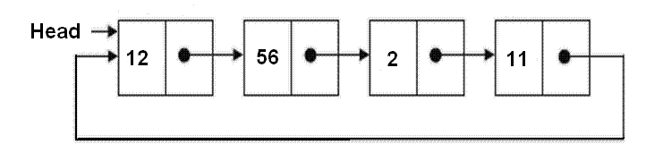

class:middle
## OTHER TYPES OF LINKED LISTS
### *doubly linked and circular linked lists*
---
class:middle
In the linked lists we have created so far, each node has **one** link, which is a pointer to the next node in the list. The list maintains a pointer to the first node, and the last node's link is set to `NULL`.

What we have simply been calling "linked lists" are actually specifically *singly linked lists*, because nodes are connected by single links.

We will look at two variations of linked lists: doubly linked lists, and circular linked lists.
---
class:middle
### Doubly linked lists
In a doubly linked list, each node has **two** links: one to the next node, as with singly linked lists, and also one to the *previous* node.


---
class:middle
Doubly linked nodes have 3 fields: the element data, a link to the next node, and a link to the previous node.
```c++
template <class T>
class DoublyLinkedList {
	class Node {
		T data;
		Node *prev, *next;
		Node(T d, Node *p, Node *n):
			data(d), prev(p), next(n) {}
	} *head;
	// ....
};
```
Again, the linked list itself only needs a pointer to the first node. (What would the pros and cons of also maintaining a pointer to the last node be?)
---
class:middle
As with singly linked lists, the `next` pointer of the last node in the list should be `NULL`. In addition to that, the `prev` pointer of the first link should also be `NULL` in doubly linked lists, so that we know when we reached the first node when traversing a list backwards.
---
class:middle
Traversing a doubly linked list backwards is more efficient than doing so with a singly linked list.
---
class:middle
To print a **singly** linked list in reverse is pretty hairy:
```c++
SLList<T>::Node *lastPrinted = 0, *current = head;
while (lastPrinted != head) {
	current = head;
	while (current->next != lastPrinted) {
		current = current->next;
	}
	cout << current->data << " ";
	lastPrinted = current;
}
cout << endl;
```
To find the node before the last node that was printed requires a loop. To do this iteratively (for every element) requires another loop with the first loop nested inside. Nested loops are bad for efficiency.
---
class:middle
To print a **doubly** linked list in reverse is simple:
```c++
DLList<T>::Node *n = head;
while (n && n->next != 0) n = n->next;
while (n != 0) {
	cout << n->data << " ";
	n = n->prev;
}
cout << endl;
```
Simply find the last element, and then traverse backwards using each node's `prev` pointer.
---
class:middle
The ease of traversing in any direction can also apply to *iterators*, if we would like to implement them.
---
class:middle
Maintaining correct links in operations like `insert` and `delete` can be more complex.
---
class:middle
`append` is simple enough. Just remember to set the new tail node's `prev` pointer to an appropriate value.
```c++
template <class T>
void DLList<T>::append(T d) {
	if (head == 0) {
		head = new DLList<T>::Node(d, 0, 0);
	} else {
		DLList<T>::Node *current = head;
		while (current->next != 0)
			current = current->next;
		current->next = new DLList<T>::Node(d, current, 0);
	}
}
```
---
class:middle
`insert` is more complex. If the new node is in the middle somewhere, both the new node's `next`'s `prev` and the new node's `prev`'s `next` should point to the new node. If it is at either edge, either its `next` or its `prev` pointers, or both, should be `NULL`.
```c++
template <class T>
void DLList<T>::insert(T d) {
	DLList<T>::Node *current = head;
	while (current && current->next && current->next->data < d) {
		current = current->next;
	}
	if (current == head && (!current || current->data > d))
      head = new DLList<T>::Node(d, 0, current);
	else if (current->next)
		current->next = current->next->prev =
			new DLList<T>::Node(d, current, current->next);
	else
   	current->next =
			new DLList<T>::Node(d, current, current->next);
}
```
---
class:middle
When a node is `remove`d, also remember to adjust its `next`'s `prev` as well as its `prev`'s `next`, if any. (If the node's `prev` is `NULL`, it is the head, and the list's `head` should be adjusted accordingly.)
```c++
template <class T>
void DLList<T>::remove(T d) {
	DLList<T>::Node *current = head;
	while (current && current->data != d) {
		current = current->next;
	}
	if (current) {
		if (current->prev)
			current->prev->next = current->next;
		else
			head = current->next;
		if (current->next)
			current->next->prev = current->prev;
		delete current;
	}
	// else throw an exception or whatever
}
```
---
class:middle
### Circular linked lists
In a circular linked list, the last node's `next` link points to the first.


---
class:middle
In a circular linked list, if `head` is not `NULL`, every node's `next` is guaranteed not to be `NULL`. The old convention where the last node's `next` is `NULL` doesn't apply anymore; the last node's `next` is now `head`.
---
class:middle
The node and linked list class declarations remain unchanged:
```c++
template <class T>
class CLList {
	class Node {
	public:
		T data;
		Node *next;
		Node(T d, Node* n=0): data(d), next(n) {}
	} *head;
public:
      // ...
};
```
---
class:middle
An empty list is still one where `head` is `NULL`:
```c++
template <class T>
CLList<T>::CLList() : head(0) {
}

bool CLList<T>::isEmpty() {
	return head == 0;
}
```
---
class:middle
But when traversing a circular list, you should stop when you reach head again.

It can be tricky to set up your loops correctly, because the start conditions are the same as the end conditions. If you do something like this:
```c++
CLList<T>::Node *tmp = head;
while (tmp != head) {
	// visit tmp
	tmp = tmp->next;
}
```
...then the loop won't run even once, because `tmp` is `head` right from the start.

Two ways to iterate through a circular list are:
1. Visit head first; traverse to the next node; loop until you reach head again
2. loop until the next node you visit is head; visit the last node
---
class:middle
For example:
```c++
template <class T>
void CLList<T>::printContents() {
	if (head) {
		cout << head->data << " ";
		CLList<T>::Node *current = head->next;
		while (current != head) {
			cout << current->data << " ";
			current = current->next;
		}
	}
	cout << endl;
}
```
---
class:middle
`insert` has three main cases:
1. inserting into an empty list
1. inserting as the new head
2. inserting elsewhere
---
class:middle
Inserting into an empty list is simple:
```c++
if (!head) {
	head = new CLList<T>::Node(d);
	head->next = head;
}
```
---
class:middle
To insert an element as the new head of a non-empty list:
1. find the node whose `next` is `head` (which can either be the last node in the list, or `head`, if it is the only element - it doesn't matter, the code is the same); let's call this node `prev`
2. set `head` to the new node
3. set `prev`'s `next` to the new `head`
---
class:middle
```c++
// ...
if (head->data > d) { // d is the element to insert
	CLList<T>::Node *current = head;
	while (current->next != head)
		current = current->next;
	head = new CLList<T>::Node(d, head);
	current->next = head;
}
// ...
```
---
class:middle
To insert an element elsewhere is done exactly as with normal singly linked lists:
1. find the position to insert the new node into (have a pointer to a node whose `next` should be the new node)
2. the new node gets the previous node's `next` as its `next`, and it becomes the previous node's `next`

If the new node is inserted at the end, the previous node's `next` will be `head`, which is correct.
---
class:middle
```c++
// ...
else {
	while (current->next != head && current->next->data < d)
		current = current->next;
	current->next = new CLList<T>::Node(d, current->next);
}
```
---
class:middle
`remove` has roughly the same cases as `insert`, with a special case for removing the only element in the list. The cases are:
1. the list is empty, or the element to remove is otherwise not in the list
2. the element to remove is at the head
  1. the list has only one element
  2. the list has other elements
3. the element to remove is elsewhere
---
class:middle
If the list is empty, or if the element is not found, return (or something); else, we have the element:
```c++
// ...
if (!head) return; // or something
CLList<T>::Node *n = head->next;
while (n != head && n->data != d)
	n = n->next;
if (n->data != d) return; // or something
// else, n points to the element to remove
// ...
```
---
class:middle
If the element to remove is `head` **and** it is the only element:
```c++
if (n == head && n->next == n) {
	head = 0;
	delete n;
}
// ...
```
... then `head` should be set to `NULL` to indicate that the list becomes empty, and the node should be deallocated.
---
class:middle
If the element to remove is `head` and there are other elements:
```c++
//...
else if (n == head) {
	CLList<T>::Node *p = n;
	while (p->next != n)
		p = p->next;
	p->next = n->next;
	head = p->next;
	delete n;
}
// ...
```
... find the "previous" element (whose `next` is head) (a.k.a the tail), set its next to the node after `head` (even if that's the tail), set `head` to the node after `head`, and deallocate the old head.
---
class:middle
If the element is not at the head:
```c++
else {
	CLList<T>::Node *p = head;
	while (p->next != n)
		p = p->next;
	p->next = n->next;
	delete n;
}
```
Find the node before the one to remove (let's call it `p` for previous), set its next to its next's next (to logically remove its next from the list), and deallocate the node to remove.
---
class:middle
The destructor might also have to be modified from its singly linked list implementation. Here is a hacky implementation using existing code:
```c++
template <class T>
CLList<T>::~CLList() {
	while (head) {
		T d = head->data;
		remove(d);
	}
}
```
