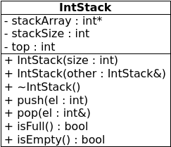

background-image:url(./i/books.jpg)
# Stacks
---
#Stacks
Stacks are
- sequential data structures
- elements inserted and removed from one end only
- LIFO (equivalently, FILO)

Basic operations on stacks are
- push
- pop
- sometimes, top
---
## Applications of stacks
Stacks naturally represent situations where you want to work with the last-stored element first
- program call stack
- calculators
---
## Implementing stacks
- as an array (*static*)
- as a linked list (*dynamic*)
---
## Static stack implementation

---
## Static stack implementation
- fixed size array
- top of stack is actually right-most element
- keep track of top with a `top` variable
  - e.g. a stack with 1 element
  - that element is at position 0
  - so `top` is 0
- push inserts new element at `top` position and moves top position right
- pop() doesn't remove anything, but moves top position left
- stack is empty when top position is -1
- stack is full when top position is size-1
---
## Static stack implementation
```c++
template <class T>
class Stack {
private:
	T *stackArray;
	int stackSize;
	int top;

public:
	Stack(int);
	Stack(Stack &);
	~Stack();
	void push(T);
	void pop(T &);
	bool isFull();
	bool isEmpty();
};
```
.nop[**]
---
## Static stack implementation
```c++
template<class T>
Stack<T>::Stack(int size) {
	stackArray = new T[size];
	stackSize = size;
	top = -1;
}
```
---
## Static stack implementation
```c++
template<class T>
Stack<T>::Stack(Stack &other) {
	// 1
	if (other.size > 0)
		stackArray = new T[other.stackSize];
	else
		stackArray = 0;

	// 2
	stackSize = other.stackSize;

	// 3
	for (int i = 0; i < stackSize; i++)
		stackArray[i] = other.stackArray[i];

	// 4
	top = other.top;
}
```
---
## Static stack implementation
```c++
template<class T>
Stack<T>::~Stack() {
	delete [] stackArray;
}
```
---
## Static stack implementation
```c++
template<class T>
bool Stack<T>::isFull() {
	return top == stackSize-1;
}
```
---
## Static stack implementation
```c++
template<class T>
bool Stack<T>::isEmpty() {
	return top == -1;
}
```
---
## Static stack implementation
```c++
template<class T>
void Stack<T>::push(T element) {
	if (isFull())
		throw "Stack is full!";
	stackArray[++top] = element;
}
```
---
## Static stack implementation
```c++
template<class T>
void Stack<T>::pop(T &element) {
	if (isEmpty())
		throw "Stack is empty!";
	num = stackArray[top--];
}
```
---
## Calculator stacks
```c++
class IntStack {
private:
	int *stackArray;
	int stackSize;
	int top;
public:
	IntStack(int);
	IntStack(IntStack&);
	void push(int);
	void pop(int&);
	bool isFull();
	bool isEmpty();

	// new members:
	void add();
	void subtract();
};
```
.nop[**]
---
## Calculator stacks
```c++
void IntStack::add() {
	int num, sum;
	pop(sum);
	pop(num);
	sum += num;
	push(sum);
}
```
---
## Calculator stacks
```c++
void IntStack::add() {
	int num, diff;
	pop(diff);
	pop(num);
	diff -= num;
	push(diff);
}
```
---
## Dynamic stack implementation
A dynamic implementation of a stack could use a linked-list structure to store elements.

A linked-list stack can grow and shrink dynamically, which is nice because
- the size does not have to be determined beforehand
- a linked list won't get full
- no memory space is wasted on unoccupied elements
---
## Dynamic stack implementation
Which end of the list should be the top?
--


Since we only ever access the top directly, it makes sense to regard the **front** (head) of the list as the top.
--


The top of the list will be a pointer to the same node as the head of the list, so we can replace `head` with `top` as the structure's only member variable.
---
## Dynamic stack implementation
```c++
template <class T>
class DStack {
private:
   class Node {
   public:
      T value;
      Node *next;
      Node(T v, Node *n): value(v), next(n) {}
   } *top;
public:
   DStack(): top(0) {}
   DStack(DStack&);
   ~DStack();
   void push(T);
   void pop(T&);
   bool isEmpty();
};
```
.nop[**]
---
## Dynamic stack implementation
Copy constructor:
```c++
template <class T>
Stack<T>::Stack(Stack &other) {
   top = 0;
   if (!other.top) return;
   Node *n = other.top;
   top = new Node(n->val, 0);
   Node *p = top;
   n = n->next;
   while (n) {
      p->next = new Node(n->val, 0);
      p = p->next;
      n = n->next;
   }
}
```
.nop[**]
---
## Dynamic stack implementation
Destructor:
```c++
template <class T>
DStack<T>::~DStack() {
   DStack<T>::Node *n = top;
   // or just Node *n = top;
   while (n) {
      top = top->next;
      delete n;
      n = top;
   }
}
```
.nop[**]
---
## Dynamic stack implementation
Push (the textbook way):
```c++
template <class T>
void DStack<T>::push(T v) {
   DStack<T>::Node *newNode = 0; // why 0 here, and then
   newNode = new DStack<T>::Node; // this directly after?
   newNode->value = v;
   if (isEmpty()) { // WHY ALL THIS????
      top = newNode;
      newNode->next = 0; // if the list is empty,
                  // top will be NULL anyway!????
   } else {
      newNode->next = top;
      top = newNode;
   }
   // this code is weak sauce
}
```
.nop[**]
---
## Dynamic stack implementation
Push (the nice way):
```c++
template <class T>
void DStack<T>::push(T v) {
   top = new DStack<T>::Node(v, top);
}
```
---
## Dynamic stack implementation
Pop:
```c++
template <class T>
void DStack<T>::pop(T &item) {
   if (isEmpty())
      throw "Stack is empty!";
   item = top->value; // get the top item back
   DStack<T>::Node *n = top->next;
   delete top;
   top = n;
}
```
.nop[**]
---
## Dynamic stack implementation
isEmpty (the textbook way):
```c++
template <class T>
void DStack<T>::isEmpty() {
   bool status;
   if (!top)
      status = true;
   else
      status = false;
   return status;
}
```
This is a hella lumbersome way to return the result. Why not just go...
---
## Dynamic stack implementation
isEmpty (shorter way):
```c++
template <class T>
void DStack<T>::isEmpty() {
   bool status = false;
   if (!top)
      status = true;
   return status;
}
```
Start by assuming the list is not empty, and only change your mind if you find that it is. Or better yet...
---
## Dynamic stack implementation
isEmpty (still shorter):
```c++
template <class T>
void DStack<T>::isEmpty() {
   bool status = (top == 0);
   return status;
}
```
We were going to use a boolean expression to determine the status of the list anyway, so we might as well initialize the status with the result of that expression. After all, the types match, and they represent the same thing! But wait...
---
## Dynamic stack implementation
isEmpty (the one-line way):
```c++
template <class T>
void DStack<T>::isEmpty() {
   return (top == 0);
}
```
Why even store the result of a single expression in a variable if you are going to return it immediately? That's just wasteful.
---
Rant over.
