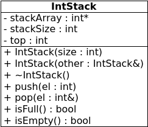

background-image:url(./i/books.jpg)
# Stacks
---
#Stacks
Stacks are
- sequential data structures
- elements inserted and removed from one end only
- LIFO (equivalently, FILO)

Basic operations on stacks are
- push
- pop
- sometimes, top
---
## Applications of stacks
Stacks naturally represent situations where you want to work with the last-stored element first
- program call stack
- calculators
---
## Implementing stacks
- as an array (*static*)
- as a linked list (*dynamic*)
---
## Static stack implementation

---
## Static stack implementation
- fixed size array
- top of stack is actually right-most element
- keep track of top with a `top` variable
  - e.g. a stack with 1 element
  - that element is at position 0
  - so `top` is 0
- push inserts new element at `top` position and moves top position right
- pop() doesn't remove anything, but moves top position left
- stack is empty when top position is -1
- stack is full when top position is size-1
---
## Static stack implementation
```c++
template <class T>
class Stack {
private:
	T *stackArray;
	int stackSize;
	int top;

public:
	Stack(int);
	Stack(Stack &);
	~Stack();
	void push(T);
	void pop(T &);
	bool isFull();
	bool isEmpty();
};
```
.nop[**]
---
## Static stack implementation
```c++
template<class T>
Stack<T>::Stack(int size) {
	stackArray = new T[size];
	stackSize = size;
	top = -1;
}
```
---
## Static stack implementation
```c++
template<class T>
Stack<T>::Stack(Stack &other) {
	// 1
	if (other.size > 0)
		stackArray = new T[other.stackSize];
	else
		stackArray = 0;

	// 2
	stackSize = other.stackSize;

	// 3
	for (int i = 0; i < stackSize; i++)
		stackArray[i] = other.stackArray[i];

	// 4
	top = other.top;
}
```
---
## Static stack implementation
```c++
template<class T>
Stack<T>::~Stack() {
	delete [] stackArray;
}
```
---
## Static stack implementation
```c++
template<class T>
bool Stack<T>::isFull() {
	return top == stackSize-1;
}
```
---
## Static stack implementation
```c++
template<class T>
bool Stack<T>::isEmpty() {
	return top == -1;
}
```
---
## Static stack implementation
```c++
template<class T>
void Stack<T>::push(T element) {
	if (isFull())
		throw "Stack is full!";
	stackArray[++top] = element;
}
```
---
## Static stack implementation
```c++
template<class T>
void Stack<T>::pop(T &element) {
	if (isEmpty())
		throw "Stack is empty!";
	element = stackArray[top--];
}
```
---
## Calculator stacks
```c++
class IntStack {
private:
	int *stackArray;
	int stackSize;
	int top;
public:
	IntStack(int);
	IntStack(IntStack&);
	void push(int);
	void pop(int&);
	bool isFull();
	bool isEmpty();

	// new members:
	void add();
	void subtract();
};
```
.nop[**]
---
## Calculator stacks
```c++
void IntStack::add() {
	int num, sum;
	pop(sum);
	pop(num);
	sum += num;
	push(sum);
}
```
---
## Calculator stacks
```c++
void IntStack::subtract() {
	int num, diff;
	pop(diff);
	pop(num);
	diff -= num;
	push(diff);
}
```
---
## Dynamic stack implementation
A dynamic implementation of a stack could use a linked-list structure to store elements.

A linked-list stack can grow and shrink dynamically, which is nice because
- the size does not have to be determined beforehand
- a linked list won't get full
- no memory space is wasted on unoccupied elements
---
## Dynamic stack implementation
Which end of the list should be the top?
--


It might be tempting to say that the last element should be the top, like it is in the static array implementation. But, since we only ever access the top directly, it makes sense to regard the **front** (head) of the list as the top.
--


The top of the list will be a pointer to the same node as the head of the list, so we can replace `head` with `top` as the structure's only member variable.
---
## Dynamic stack implementation
```c++
template <class T>
class DStack {
private:
   class Node {
   public:
      T value;
      Node *next;
      Node(T v, Node *n): value(v), next(n) {}
   } *top;
public:
   DStack(): top(0) {}
   DStack(DStack&);
   ~DStack();
   void push(T);
   void pop(T&);
   bool isEmpty();
};
```
.nop[**]
---
## Dynamic stack implementation
Copy constructor:
```c++
template <class T>
Stack<T>::Stack(Stack &other) {
   top = 0;
   if (!other.top) return;
   Node *n = other.top;
   top = new Node(n->val, 0);
   Node *p = top;
   n = n->next;
   while (n) {
      p->next = new Node(n->val, 0);
      p = p->next;
      n = n->next;
   }
}
```
.nop[**]
---
## Dynamic stack implementation
Destructor:
```c++
template <class T>
DStack<T>::~DStack() {
   DStack<T>::Node *n = top;
   // or just Node *n = top;
   while (n) {
      top = top->next;
      delete n;
      n = top;
   }
}
```
.nop[**]
---
## Dynamic stack implementation
Push (the textbook way):
```c++
template <class T>
void DStack<T>::push(T v) {
   DStack<T>::Node *newNode = 0; // why 0 here, and then
   newNode = new DStack<T>::Node; // this directly after?
   newNode->value = v;
   if (isEmpty()) { // WHY ALL THIS????
      top = newNode;
      newNode->next = 0; // if the list is empty,
                  // top will be NULL anyway!????
   } else {
      newNode->next = top;
      top = newNode;
   }
   // this code is weak sauce
}
```
.nop[**]
---
## Dynamic stack implementation
Push (the nice way):
```c++
template <class T>
void DStack<T>::push(T v) {
   top = new DStack<T>::Node(v, top);
}
```
---
## Dynamic stack implementation
Pop:
```c++
template <class T>
void DStack<T>::pop(T &item) {
   if (isEmpty())
      throw "Stack is empty!";
   item = top->value; // get the top item back
   DStack<T>::Node *n = top->next;
   delete top;
   top = n;
}
```
.nop[**]
---
## Dynamic stack implementation
isEmpty (the textbook way):
```c++
template <class T>
void DStack<T>::isEmpty() {
   bool status;
   if (!top)
      status = true;
   else
      status = false;
   return status;
}
```
This is a hella lumbersome way to return the result. Why not just go...
---
## Dynamic stack implementation
isEmpty (shorter way):
```c++
template <class T>
void DStack<T>::isEmpty() {
   bool status = false;
   if (!top)
      status = true;
   return status;
}
```
Start by assuming the list is not empty, and only change your mind if you find that it is. Or better yet...
---
## Dynamic stack implementation
isEmpty (still shorter):
```c++
template <class T>
void DStack<T>::isEmpty() {
   bool status = (top == 0);
   return status;
}
```
We were going to use a boolean expression to determine the status of the list anyway, so we might as well initialize the status with the result of that expression. After all, the types match, and they represent the same thing! But wait...
---
## Dynamic stack implementation
isEmpty (the one-line way):
```c++
template <class T>
void DStack<T>::isEmpty() {
   return (top == 0);
}
```
Why even store the result of a single expression in a variable if you are going to return it immediately? That's just wasteful.
---
Rant over.
---
## STL stacks

It's possible to use a vector as a stack by limiting yourself to only using certain methods. If you regard the front of a vector as a stack's top, then, if you only use `push_front()`, `pop_front()`, and `front()`, the vector acts exactly like a stack.
--


To conform to the interface we normally associate with stacks, we can apply this idea, but create a new class called `vectorStack` that uses a vector as a private inner container, and provides public functions called `push`, `pop`, etc. that reroute their actions to the inner container.
---
## STL stacks
A stack that uses a vector to store elements:
```c++
#include <vector>
using namespace std;
template <class T>
class vectorStack {
private:
   vector<T> v;
public:
   void push(T el) {v.push_front(el);}
   void pop() {v.pop_front();}
   // etc
};
```
---
## STL stacks
You can also use an STL list:
```c++
#include <list>
using namespace std;
template <class T>
class listStack {
private:
   list<T> l;
public:
   void push(T el) {l.push_front(el);}
   void pop() {l.pop_front();}
   // etc
};
```
---
## STL stacks
... or a deque:
```c++
#include <deque>
using namespace std;
template <class T>
class dequeStack {
private:
   deque<T> d;
public:
   void push(T el) {d.push_front(el);}
   void pop() {d.pop_front();}
   // etc
};
```
--

We could abstract the container in which to store elements in a stack like this using a template.
---
## STL stacks
The C++ libraries provide a special class called `stack`. Stack isn't actually a complete container; it is called a *container adaptor*, meaning it adapts other containers to act like stacks.
--


**Note that** `stack` regards the **back** of the container it uses as its top. Certain containers with `back()`, `push_back()`, and `pop_back()` methods can be adapted by the `stack` adaptor to act like a stack.

---

## STL stacks
When you declare a stack, you can specify which type it should use as an inner container:
```c++
#include <vector>
#include <stack>
using namespace std;
int main() {
   stack<int, vector<int> > myStack;
}
```
--

`stack` takes two *type parameters*:
1. The type of the element to be stored in the stack
2. The type of the container to store the elements in internally

In this example, the stack stores `int`s in a `vector` that also stores `ints`.
---
### Notes
1. Prior to C++11, compilers would take the `>>` part of a fragment like `stack<int,vector<int>>` as the stream insertion operator, so you should separate like-sided angled brackets with a space, like in `stack<int,vector<int> >`
2. The inner container must be a so-called `SequenceContainer` and provide push_-, pop_- and back functions. You can use a stack with a vector, a list, or a deque.
---
## STL stacks
You can also construct a stack from an existing container:
```c++
#include <list>
#include <stack>
using namespace std;
int main() {
   list<char> myList;
   myList.push_back('x');
   myList.push_back('y');
   myList.push_back('z');
   stack<char, list<char> > myStack(myList);
}
```
Here it's important to remember which side of the container is regarded as the top of the stack - it's the **back**.
---
## STL stacks
`stack` is declared as:
```c++
template <class T, class Container = deque<T> > class stack;
```
In other words, `stack` uses `deque<T>` as the *default type* for the container to store elements in, so if you do something like this:
```c++
#include <stack>
using namespace std;
int main() {
   stack<float> myStack();
}
```
...then your stack will use a `deque<float>` object to store your `float` elements.
---
## STL stacks

The STL `stack` provides these public member functions:
- push
- pop
- top
- empty
- size
- swap
- emplace
---
## STL stacks - basic functions
### push
`push` works just like we would expect: it adds the element passed as a parameter to the back of its inner container.
### pop
`pop` removes the top element from the stack (by calling `pop_back` on the inner container), but it doesn't return the top element - neither as a return value, nor as a reference parameter. To access the top element, you must use `top`.
### top
`top` simply returns the top element without modifying the stack.
---
## STL stacks - basic functions
### empty
This function returns `true` if the inner list - and hence the stack - is empty.
### size
This function returns the number of elements in the stack.
---
## STL stacks - other functions
### swap
This function takes another stack as a parameter by reference. It swaps the contents of itself with that of the other stack by swapping the contents of their inner structures.
### emplace
This function is only available in C++11. It performs basically the same task as `push`, but if the object that is pushed to the stack has a constructor, this function ensures that the object will be constructed in place and not be copied or moved unnecessarily.
---
