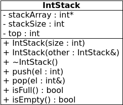

background-image:url(./i/books.jpg)
# Stacks
---
#Stacks
Stacks are
- sequential data structures
- elements inserted and removed from one end only
- LIFO (equivalently, FILO)

Basic operations on stacks are
- push
- pop
- sometimes, top
---
## Applications of stacks
Stacks naturally represent situations where you want to work with the last-stored element first
- program call stack
- calculators
---
## Implementing stacks
- as an array (*static*)
- as a linked list (*dynamic*)
---
## Static stack implementation

---
## Static stack implementation
- fixed size array
- top of stack is actually right-most element
- keep track of top with a `top` variable
  - e.g. a stack with 1 element
  - that element is at position 0
  - so `top` is 0
- push inserts new element at `top` position and moves top position right
- pop() doesn't remove anything, but moves top position left
- stack is empty when top position is -1
- stack is full when top position is size-1
---
## Static stack implementation
```c++
template <class T>
class Stack {
private:
	T *stackArray;
	int stackSize;
	int top;

public:
	Stack(int);
	Stack(Stack &);
	~Stack();
	void push(T);
	void pop(T &);
	bool isFull();
	bool isEmpty();
};
```
.nop[**]
---
## Static stack implementation
```c++
template<class T>
Stack<T>::Stack(int size) {
	stackArray = new T[size];
	stackSize = size;
	top = -1;
}
```
---
## Static stack implementation
```c++
template<class T>
Stack<T>::Stack(Stack &other) {
	// 1
	if (other.size > 0)
		stackArray = new T[other.stackSize];
	else
		stackArray = 0;

	// 2
	stackSize = other.stackSize;

	// 3
	for (int i = 0; i < stackSize; i++)
		stackArray[i] = other.stackArray[i];

	// 4
	top = other.top;
}
```
---
## Static stack implementation
```c++
template<class T>
Stack<T>::~Stack() {
	delete [] stackArray;
}
```
---
## Static stack implementation
```c++
template<class T>
bool Stack<T>::isFull() {
	return top == stackSize-1;
}
```
---
## Static stack implementation
```c++
template<class T>
bool Stack<T>::isEmpty() {
	return top == -1;
}
```
---
## Static stack implementation
```c++
template<class T>
void Stack<T>::push(T element) {
	if (isFull())
		throw "Stack is full!";
	stackArray[++top] = element;
}
```
---
## Static stack implementation
```c++
template<class T>
void Stack<T>::pop(T &element) {
	if (isEmpty())
		throw "Stack is empty!";
	num = stackArray[top--];
}
```
---
## Calculator stacks
```c++
class IntStack {
private:
	int *stackArray;
	int stackSize;
	int top;
public:
	IntStack(int);
	IntStack(IntStack&);
	void push(int);
	void pop(int&);
	bool isFull();
	bool isEmpty();

	// new members:
	void add();
	void subtract();
};
```
.nop[**]
---
## Calculator stacks
```c++
void IntStack::add() {
	int num, sum;
	pop(sum);
	pop(num);
	sum += num;
	push(sum);
}
```
---
## Calculator stacks
```c++
void IntStack::add() {
	int num, diff;
	pop(diff);
	pop(num);
	diff -= num;
	push(diff);
}
```
---
