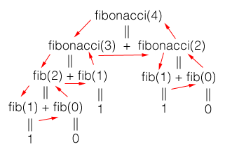

class:middle
# Recursion continued
---
### Recursively defined problems:
### Fibonacci
Some mathematical problems are *defined* recursively. The Fibonacci numbers are
```
0 1 1 2 3 5 8 13 21 34 55 89 144 233
```

The *n*th Fibonacci number is given by...
--


- 0 if *n* = 0
- 1 if *n* = 1
- the *n-1*th + the *n-2*th Fibonacci number for all others

--

This is clearly a recursive definition
.nop[*]
---
### Recursively defined problems:
### Fibonacci
This is very simple to change into C++ code:
```c++
int fibonacci(int n) {
   if (n <= 0)
      return 0;
   if (n == 1)
      return 1;
   return fibonacci(n-1) + fibonacci(n-2);
}
```
--


Two observations about the code:
- There are two base cases: n <= 0 and n == 1. This is valid.
- The recursive step makes two recursive calls, which is also valid, but keep in mind that the function will "branch out" at each recursive call. This increases the complexity of the function.
---
### Recursively defined problems:
### Fibonacci
We can picture the call stack of a call to `fibonacci(4)` as follows:

.nop[]

.center[]
---
### Recursively defined problems:
### Euclid's GCD
The greatest common divisor for two numbers x and y can be defined
- *y* if *y* divides *x* evenly
- the GCD of *y* and the remainder of *x/y* otherwise

Write C++ code for a function called
```c++
int gcd(int x, int y)
```
that calculates the greatest common divisor of its two parameters recursively.
---
### Recursively defined problems:
### Euclid's GCD
```c++
int gcd(int x, int y) {
   if (x % y == 0)
      return y;
   // else (implied)
      return gcd(y, x%y);
}
```
.nop[']
---
### Recursive linked list operations:
### Counting nodes
Suppose we have a non-circular singularly linked list, and we want to write a function to count the nodes. This can be done quite simply with recursion. We will need to traverse the list, so the function will need a node pointer as a parameter.

The base case will be
--

when the node pointer is null.

In the recursive case, we will return 1 + the result of
--

a call to the function with the `next` value of the node passed to this call.
---
### Recursive linked list operations:
### Counting nodes
The function will look something like this:
```c++
int numItems(Node *n) {
   if (n == 0)
      return 0;
   else
      return 1 + numItems(n->next);
}
```
--


Note that the function requires us to pass a node pointer to it. To count all the nodes in the list, we have to pass `head` to the function initially. However, the user shouldn't have access to `head`, which is a private member variable. Moreover, the user shouldn't be required to work with `Node` objects or pointers directly; from the user's point of view, a linked list should be a simple container.
.nop[*]
---
### Recursive linked list operations:
### Counting nodes
To make the linked list class more user-friendly, we can make the previously defined `numItems` function a private helper function, which the user will never call directly. Then we can define a public function, possibly with the same name, that takes no parameters, and simply calls the helper function with the appropriate parameters.
```c++
class LinkedList {
   struct Node {
      int val,
      Node *next
   } * head; // private!
   int numItems(Node *); // also private!
public:
   // ...
   numItems() {
      return numItems(head);
   }
}
```
.nop[*]
---
### Recursive linked list operations:
### Printing in reverse
One way that a recursive function differs from a loop, is that it generates a stack, and then winds it down; this means that, depending on where statements are located relative to recursive calls in the function, they can be executed in the order that the functions are called, or in the reverse order.
---
### Recursive linked list operations:
### Printing in reverse
For example, this function:
```c++
void foo(int i, int max) {
   if (i >= max)
      return;
   cout << "counting up: " << i << endl;
   foo(i+1, max);
   cout << "counting down: " << i << endl;
}
```
---
### Recursive linked list operations:
### Printing in reverse
...will produce this output if called as `foo(1, 3)`:
```
counting up: 1
counting up: 2
counting up: 3
counting down: 3
counting down: 2
counting down: 1
```
because the `counting up` statement is placed before the recursive call, and the `counting down` statement is after it.
---
### Recursive linked list operations:
### Printing in reverse
We can use the fact that statements *after* a recursive call will be called as the stack winds down to do things in reverse. Suppose you want to write a function that prints the contents of a linked list in reverse. This can be done quite simply as follows (first try it yourself):
--

```c++
void printInReverse(Node *n) {
   if (n == 0)
      return;
   printInReverse(n->next);
   cout << n->data << endl;
}
```
.nop[*]
---
### Recursive linked list operations:
### Printing in reverse
Again, we shouldn't require the user to call the function with the correct node, so we can make the `printInReverse(Node*)` function a private helper, and provide the following as a public function:
```c++
void printInReverse() {
   printInReverse(head);
}
```
In practice, there are many cases where a recursive solution requires the correct parameters to be passed to the function initially. In such cases, it is common practice to leave the recursive solution out of the public interface, and instead use it as a helper function that is called by the publicly exposed functions.
---
### Tail recursive functions
A function is tail recursive if it returns immediately after a recursive call, without performing any more calculations. For example, this function is tail recursive:
```c++
int f(int x, int y) {
  if (y == 0) {
    return x;
  }
  return f(x*y, y-1);
}
```
because the final instruction (besides the return statement) is a recursive call.
---
### Tail recursive functions
Contrast with this function, which is **not** tail recursive:
```c++
int g(int x) {
  if (x == 1) {
    return 1;
  }
  int y = g(x-1);
  return x*y;
}
```
The last instruction is a computation.
---
### Tail recursive functions
Also note that `g` could have been written as
```c++
int g(int x) {
  if (x == 1) {
    return 1;
  }
  return x*g(x-1);
}
```
It's still not tail recursive; after the recursive call returns, the result is used in a computation, and only then does the function return.
---
### Tail recursive functions
Why do we distinguish? Because tail recursion can be used to optimize recursive code. More on that in a bit.
---
### Recursion vs iteration
There are many reasons to avoid recursion:
- the majority of repetitive problems are more suited to loops
- each recursive call requires far more overhead than an iteration of a loop

However, on modern computers, code efficiency is becoming less of a legitimate concern. For smaller problems that won't fill up the stack, if recursion is a more natural fit, then the textbook encourages you to use recursion.
---
### Tail recursion optimization
Tail recursive code can usually be optimized. If it is known that a function will return immediately after its recursive call returns, then it is not necessary to keep that function in the stack; the result can be returned directly to the previous caller.

This allows the system to use the current function's stack frame for the new recursive call, which means that each new call doesn't require more space on the stack. Remember that, normally, a major drawback of recursion is that each new call takes up more stack space; this optimization is therefore quite significant.

Some languages - especially functional languages like Haskell - guarantee tail recursion optimization. C++ does not, but some compilers implement it. The operative word here is **some**, though. Never rely on it, but if you *can* write code that will be optimized on some compilers, it's probably worth it.
---
### Quicksort
Quicksort is a sorting algorithm that takes a divide-and-conquer type of approach. Divide and conquer is also how recursion usually works, so quicksort is a good candidate for recursive implementation.

Quicksort works as follows:
1. Select an element, called a *pivot*, from the array.
2. Reorder the array so that the pivot is larger than everything to its right, and less than everything to its left.
3. Recursively quicksort the rest of the elements to the left of the pivot.
4. Recursively quicksort the rest of the elements to the right of the pivot.

In step 2, most of the elements are not placed in their final (correct) positions. We only care that they are on the right side of the pivot, which makes this step fairly easy. The pivot itself will move around and probably not end up in the middle. After the step is done, the pivot is in its final position.
---
### Quicksort
When implementing quicksort, we usually write a separate function for step 2, called `partition`, which rearranges the array around a pivot and returns the new index of the pivot. With `partition` factored out into a function, the quicksort function itself is quite simple:
```c++
void quicksort(int set[], int start, int end) {
   int pivot;
   if (start < end) {
      pivot = partition(set, start, end);
      quicksort(set, start, pivot-1);
      quicksort(set, pivot+1, end);
   }
}
```
What `partition` effectively does, is it partitions the list into two sublists, where all the elements of the first sublist are smaller than all the elements of the second. Neither sublist is necessarily sorted, until you partition a small enough list. As the quicksort function recurses, the sublists to partition shrink, until they are necessarily sorted; and then, since the sublists themselves are "sorted", the list is.
---
### Quicksort
During `partion`, any element can be chosen as the pivot. We can implement `partition` as follows:
```c++
int partition(int set[], int start, int end) {
   int pivotIndex = start;
   int pivotValue = set[start];
   for (int i = start+1; i <= end; i++) {
      if (set[i] < pivotValue) {
         pivotIndex++;
         swap(set[pivotIndex], set[i]);
      }
      swap(set[start], set[pivotIndex]);
      return pivotIndex;
   }
}
```
---


}
```
