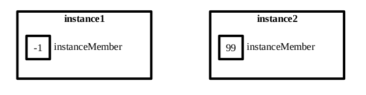
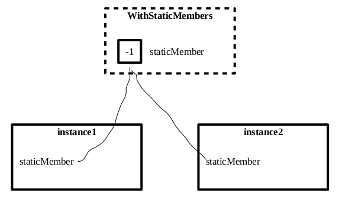

class: middle
# Tutorial 2 (?)

---

- instance & static members
- friends
- copy constructors
- operator overloading
  - assignment operator
  - binary mathematical operators
  - increment operators
  - relational operators

---

class: middle
# Instance & static members

---

## Instance & static members
### Instance members:
Each instance has its own copy in memory
```c++
class WithInstanceMembers {
public:
  int instanceMember;
  int instanceFunction() {instanceMember++;}
};
```
```
WithInstanceMembers instance1, instance2;
instance1.instanceMember = -1;
instance2.instanceMember = 99;
instance1.instanceFunction();
instance2.instanceFunction();
```

---

## Instance & static members
### Instance members:




---

## Instance & static members
### Static members:
One copy that each instance shares. Can be accessed without reference to any instance.
```c++
class WithStaticMembers {
public:
  static int staticMember;
  static int staticFunction() {staticMember++;}
};
int WithStaticMembers::staticMember = 0;
```
Must define static variable outside of class.
```
WithInstanceMembers instance1, instance2;
instance1.instanceMember = -1;
instance2.instanceMember = 99;
instance1.instanceFunction();
WithStaticMembers::instanceFunction();
```
Static functions can only access other static members.

---

## Instance & static members
### Static members:




---

class: middle
# Friends of classes

---

## Friends of classes
Functions that are not members of a particular class, but have access to private members of that class.
```c++
class WithFriends {
private:
  int privateMember;
  friend int& getPrivateMember(WithFriends&);
};

int& getPrivateMember(WithFriends &o) {
  return o.privateMember;
}
```

---

## Friends of classes
### Member functions as friends
Friend functions can also be members of other classes. To avoid circular dependency, we forward-declare one class in the other's header file.

`withfriends.h`:
```c++
#ifndef WITH_H
#define WITH_H
#include otherclass.h
class WithFriends {
private:
  int privateMember;
  friend int& OtherClass::getPrivateMember(WithFriends&);
};
#endif
```

---

## Friends of classes
### Member functions as friends

`otherclass.h`:
```c++
#ifndef OTHER_H
#define OTHER_H
class WithFriends;
class OtherClass {
public:
  int& getPrivateMember(WithFriends& o) {
    return o.privateMember;
  }
};
#endif
```

---

## Friends of classes
### Classes as friends

Whole classes can have friends. Bad practice; new functions can be added later.
```c++
class WithFriends {
  // ...
  friend class OtherClass;
};
```

---

class: middle
# Copy constructors

---

## Copy constructors
A class invokes its copy constructor in a statement like this:
```c++
MyClass copy = original;
```
C++ provides a default copy constructor that performs memberwise assignment. We can override the default implementation by providing our own.

---

## Copy constructors
```c++
class MyClass {
public:
  MyClass(MyClass&);
};
```

- Parameter **must** be a reference
- Parameter could be a const - good practice
- Parameter name can be anything
- We must implement memberwise assignment ourselves

---

## Copy constructors
Usually used to ensure that **deep copies** are made of pointer members. E.g.
```c++
class WithDynamicMember {
private:
  int *pointerMember;
public:
  WithDynamicMember() {pointerMember = new int(10);}
  WithDynamicMember(const MyClass& other) {
    pointerMember = new int(*other.pointerMember);
  }
};
```

---

class: middle
# Assignment operator

---

## Assignment operator
A class inovokes its assignment operator in a statement like this:
```c++
copy = original;
```

C++ provides a default assignment operator that performs memberwise assignment. We can override the default by overloading the operator with our own implementation.

---

## Assignment operator
```c++
class MyClass {
public:
  MyClass operator= (MyClass&);
};
```

In this statement:
```c++
lhs = rhs;
```
... the operator is called on `lhs`, and the parameter passed to the operator is `rhs`. The statement can also be written as
```c++
lhs.operator=(rhs);
```

---

## Assignment operator
Notes:
- can return any type
- must return class type to allow chaining (`o1 = o2 = o3 = o4;`)
- can be overloaded for different types; must be the class type if you want to invoke it for class objects, obviously
- must take one parameter
- parameter can be const and/or reference; not necessary
- there can be whitespace between `operator` and `=`; e.g:

```c++
MyClass operator = (MyClass&);
```

---

## Assignment operator
### this
`this` is a special pointer
- available when implementing member functions
- when member function is called, `this` will point to the object that it is called on

We can use `this` to return the calling object to the caller:
```c++
MyClass& MyClass::operator=(MyClass &o) {
  member = o.member;
  return *this;
}
```

---

class: middle
# Operator overloading

---

## Operator overloading
- The compiler allows logic errors
- Most operators can be overloaded, just not `?:` or `.` or `.*` or `::` or `sizeof`.
- The number of operands cannot change; + is always binary and ++ is always unary

---

## Overloading arithmetic operators
```c++
class Time {
  int h, m, s;
public:
  // ...
  Time operator+ (Time& o) {
    int sec = (s + o.s) % 60;
    int min = ( (s + o.s)/60 + m + o.m) % 60;
    int hour =  ( ( (s + o.s)/60 + m + o.m) / 60 + h + o.h) % 24;
    return Time(hour, min, sec);
  }
};
```

The statement
```c++
time1 = time2 + time3
```
... will call `operator+` on `time2` with `time3` as its parameter, and assign the return-value to `time1`. It is equivalent to the statement
```c++
time1.operator=(time2.operator+(time3));
```

---

## Overloading arithmetic operators
### Important note:
In the example implementation, we return a *local variable*:
```c++
return Time(hour, min, sec);
```
so that we don't modify the calling object, but return the result of the addition to anyone that uses it. This means the function **cannot** return a reference.

---

## Overloading increment operators
The increment operators are:
- prefix increment (++x)
- postfix increment (x++)

Their signatures for overloading are:
```c++
class Incrementable {
public:
  Incrementable &operator++ (); //prefix
  Incrementable  operator++ (int); //postfix
};
```
The postfix operator is distinguished by a dummy `int` variable.

---

## Overloading increment operators
Implementing the prefix increment operator is simple:
```c++
Incrementable &Incrementable::operator++() {
  localVar++;
  return *this;
}
```

---

## Overloading increment operators
Sensibly implementing the postfix increment operator is done by creating a local copy of `this`, incrementing `this`, and then returning the copy:
```c++
Incrementable Incrementable::operator++(int) {
  Incrementable copy = *this;
  ++(*this);
  return copy;
}
```
Note:
- we can't return a reference to a local variable; hence the non-ref return type
- we can use the already-define prefix increment operator to increment `*this`

---

## Overloading relational operators
The relational operators are
```c++
==
!=
<
<=
>
>=
```

---

## Overloading relational operators
They are binary operators - the left operand is the object, and the right operand is the parameter:
```c++
class Comparable {
public:
  bool operator==(Comparable& other);
}

Comparable l, r;
l == r;
l.operator==(r);
```

---

## Overloading relational operators
- Returning `bool` is sensible but not enforced by the compiler.
- All other operators can be defined in terms of `==` and `<`.
