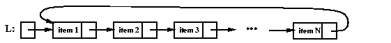

# A linked list template

```c++
template <class T> // templ prefix
class LinkedList { // class name as usual
	struct ListNode { // note: no templ prefix
		T value; // T available to inner class
		ListNode *next;
	};
	ListNode *head;
public:
	LinkedList() {head = NULL;}
	~LinkedList();
	void insertNode(T); // pass type T
	void deleteNode(T);
	void displayList();
	T get(int index); // return type T
};
```
---
# A linked list template
```c++
template <class T>
T LinkedList<T>::get(int i) {
	LinkedList<T>::Node *current = head;
	while (i > 0 && current) {
		current = current->next;
		i--;
	}
	if (current) {
		return current->data;
	} else {
		throw "out of bounds or something";
	}
}
```
---
# A linked list template
Note: some class methods use operators (like `==` or `<`) to compare element values. `LinkedList` is a template class that can be instantiated for any type; however, these methods will only compile if the instantiated type supports those operators.
---
# Node as a class
```c++
template <class T>
class LinkedList {
	class ListNode {
	public: // so we can still quickly change members
		T value;
		ListNode *next;
		ListNode(T val, ListNode *n = NULL):
			value(val), next(n) {}
	} *head; // shorthand for declaring the class
			// and using it in one statement
public:
	LinkedList() {head = NULL;}
	// etc...
};
```
---
# Node as a class
Without a node constructor, inserting a new node after a specific node was done like this:
```c++
Node *newNode = new Node<T>;
newNode->value = v; // whatever the new value should be
newNode->next = current->next;
current->next = newNode;
```
---
# Node as a class
With a node constructor, the operation can be simplified to this:
```c++
current->next = new Node<T>(v, current->next);
```
---
# Doubly linked lists

```c++
template <class T>
class DoublyLinkedList {
	class Node {
	public:
		T value;
		Node *prev, *next; // double the links!
		Node(T val, Node *p, Node *n):
			value(val), prev(p), next(n) {}
	} *head; // still only need a head link
	// ...
};
```
---
# Circular linked lists


The `next` of the last element, if any, points back to the first. If there is only one element, its `next` link points to itself.

Some things to keep in mind:
- To check if an element is the last in the list, check if its `next` is `head`
- When modifying or removing the first element, remember to change both the `head` and the `next` of the last element
---
# STL list
The Standard Template Library provides a class called `list`, which is a data structure implemented as a doubly linked list with links to the head and the tail of the list.

`front`, `back`, `push_front`, `push_back`, `pop_front` and `pop_back` provide quick access to the front and back of the list.

`begin` and `end` return iterators that represent the first position and the position *beyond* the last position, respectively:
```c++
for (list<int>::iterator i = myList.begin();
	 i != myList.end();
	 i++) {
	cout << *i << endl;
}
```
